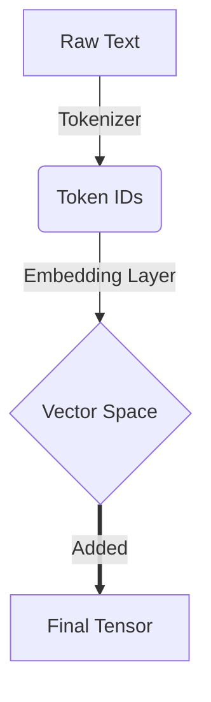

> [!abstract] Overview
> A brief summary of what this chapter covers and its place in the LLM architecture.

---
## 🎯 Why we do it
> [!info] Rationale
> Explain the underlying motivation and purpose behind this step. Why is it mathematically or architecturally necessary?

## 🛠️ How we do it
> [!tip] Methodology
> Describe the methods, tools, or algorithms used (e.g., BPE, Sliding Window, nn.Embedding).

## 📥 Input
> [!quote] Input Format
> - **Description:** `e.g., input is a Text string which has now going to be converted to numbers in this step`
>
> - **Example:** 
> ```python
> text = "Hello, world!"
> ```
## 📤 Output
> [!success] Resulting State
> - **Description:** `e.g., output is a 1D tensor which has now information about positions and relations`
>
> - **Example:** 
> ```python
tensor([15496, 11, 995, 0])```

## ⚙️ Working
> [!example] Under the Hood
> Detail the step-by-step internal workings. How does the data transform from input to output?

*Explanation of what we are about to do (e.g., Load the text file)*
```python
# code block fetched from existing ipynb
with open("the-verdict.txt", "r", encoding="utf-8") as f:
    raw_text = f.read()
```

---

*Explanation of what we are about to do (e.g., Import the tokenizer)*
```python
# another code block
import re
preprocessed = re.split(r'([,.:;?_!"()\']|--|\s)', raw_text)
```

---

## 🖼️ Appendix: Formatting Tensors and Grids
> [!tip] Displaying Tensors
> Depending on the context, here are the best ways to format tensors in your notes.

### 1. LaTeX Math Blocks (For Mathematical Theory)
$$
\begin{bmatrix}
0.12 & -0.45 & 0.88 \\
-0.01 & 0.99 & -0.22 \\
0.55 & 0.33 & 0.11
\end{bmatrix}
$$
### 2. Python Code Blocks (For Raw Output)
```python
tensor([[[ 0.12, -0.45,  0.88],
         [-0.01,  0.99, -0.22],
         [ 0.55,  0.33,  0.11]]])
```

### 3. Markdown Tables (For Labeled Dimensions)
|             | Pos 1 | Pos 2 | Pos 3 |
| ----------- | :---: | :---: | :---: |
| **Batch 1** | 0.12  | -0.45 | 0.88  |
| **Batch 2** | -0.01 | 0.99  | -0.22 |

---

## ⮑ Appendix: Formatting Vector Arrows & Flowcharts
> [!tip] Displaying Flow & Transformations
> Use these methods to illustrate data flow, transformations, and mathematical vectors.

### 1. Mermaid Flowcharts (Top-Down Pipeline)
Use `graph TD` to create clean, top-down visual pipelines for architectural explanations.


### 2. LaTeX Math Blocks (For Mathematical Vectors)
- **Standard Vector:** `$\vec{v} = [0.12, -0.45]$` rendered as $\vec{v} = [0.12, -0.45]$
- **Bold Vector (ML Standard):** `$\mathbf{x}$` rendered as $\mathbf{x}$
- **Mathematical Flow:** `$\text{Input} \xrightarrow{\text{operation}} \text{Output}$` rendered as $\text{Input} \xrightarrow{\text{operation}} \text{Output}$

### 3. Math Formulas & ML Notation
Use MathJax (LaTeX) to render professional math equations.

**Inline vs Block Math:**
- **Inline:** `The learning rate $\alpha$ is small.` $\rightarrow$ The learning rate $\alpha$ is small.
- **Block (Centered):** 

$$
\text{Attention}(Q, K, V) = \text{softmax}\left(\frac{QK^T}{\sqrt{d_k}}\right)V
$$

**Common ML Notations:**
- **Fractions:** `\frac{1}{N}` $\rightarrow$ $\frac{1}{N}$
- **Summations:** `\sum_{i=1}^{N} x_i` $\rightarrow$ $\sum_{i=1}^{N} x_i$
- **Dot Product:** `x \cdot y` $\rightarrow$ $x \cdot y$
- **Hadamard Product:** `A \odot B` $\rightarrow$ $A \odot B$
- **Sub/Superscripts:** `x_i^2` $\rightarrow$ $x_i^2$
- **Aligned Equations:** Use `\begin{align} ... \end{align}` inside `$$` for step-by-step math.

### 4. Hyperparameters & Pitfalls
Use these formats to track model configs and highlight common bugs.

**Model Config Table:**

| Parameter | Value | Description |
|---------|:-----:|:-----:|
| `vocab_size` | 50,257 | Total BPE tokens |
| `vocab_size` | 768 | Dimensionality of embeddings |


**Bug / Pitfall Callout:**
> [!bug] Common Pitfall: Shape Mismatch
> Always verify tensor shapes before matrix multiplication. e.g. `(B, T, C) @ (C, V) -> (B, T, V)`

### 5. Markdown/Obsidian Quirks
**Rule: Empty Lines in Callouts**
If you place a table, math block, or mermaid diagram *inside* a callout (e.g., `> [!success]`), you **MUST** include an empty line starting with `> ` right before it. 
Otherwise, Obsidian parses it as raw paragraph text.

> [!example] Correct Table in Callout
> Text preceding the table.
> 
> | Header | Header |
> | :--- | :--- |
> | Data | Data |

### 6. Terminologies & Hover Definitions
Use Obsidian's **Block References** to create interactive tooltips for vocabulary words. This keeps your paragraphs clean and consolidates definitions at the bottom.

**In the text:**
Wrap the term as an internal link pointing to a block anchor: `[[#^term_id|TermName]]`. 
Example: `We use a dictionary (called a [[#^vocab|vocabulary]]).`

**At the bottom of the file (before Navigation):**
Create a `## 📖 Terminologies` section and append the matching `^term_id` at the end of the bullet point.

```markdown
## 📖 Terminologies
- **Vocabulary:** A dictionary that assigns a unique number to every single piece of text. ^vocab
```

---
*Navigation:*
⬅️ **Previous Step:** [[Previous Chapter Link]] | ➡️ **Next Step:** [[Next Chapter Link]]
